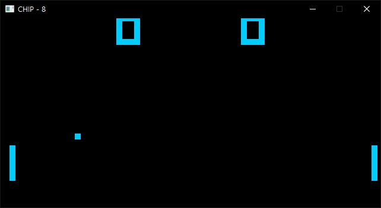

# Study Emulator

## 개요

에뮬레이터 학습을 위한 프로젝트입니다. 아래 주요 목표를 달성하기 위해 진행됩니다!

- Low-Level에 대한 충분한 이해.
- chip-8의 Pong게임 구동.
- gameboy의 게임, 꿈꾸는 섬 에뮬레이션 성공
- SFC의 구동 성공과, imgui로 제공되는 디버깅 툴.

추가적인 목표

- 번역 프로젝트의 활성화

## Chip-8

### 누가 만들었나요?

- [함시환](https://github.com/JJhuk/study_emu/commits?author=ffdd270)
- 이주혁

### 왜 chip-8인가요?

- 총 35개의 opcode가 있어 양이 적습니다.
- 너무 많은 시간을 투자하지 않고도 프로젝트를 완성할 수있습니다.

### 작동 화면

### 참고 자료

- [http://devernay.free.fr/hacks/chip8/C8TECH10.HTM](http://devernay.free.fr/hacks/chip8/C8TECH10.HTM)
- [http://www.multigesture.net/articles/how-to-write-an-emulator-chip-8-interpreter/](http://www.multigesture.net/articles/how-to-write-an-emulator-chip-8-interpreter/)
